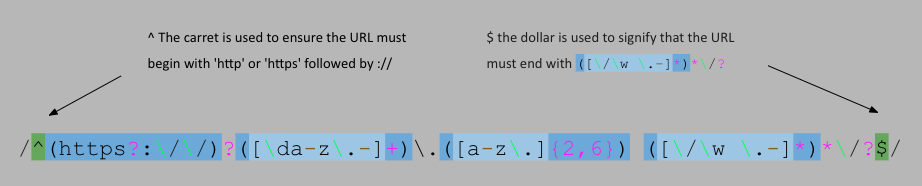
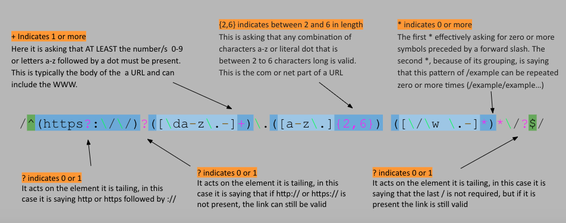
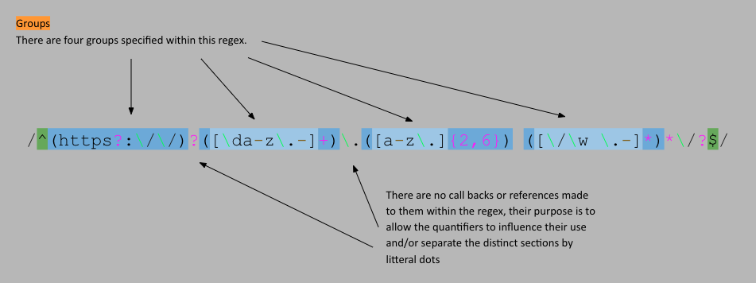
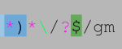

# Regex-URL-gist

This gist describes the procces of matching URL's with a regular expression set.

## Summary

Briefly summarize the regex you will be describing and what you will explain. Include a code snippet of the regex. Replace this text with your summary.

Matching a URL: `/^(https?:\/\/)?([\da-z\.-]+)\.([a-z\.]{2,6})([\/\w \.-]*)*\/?$/`

## Table of Contents

- [Anchors](#anchors)
- [Quantifiers](#quantifiers)
- [Grouping Constructs](#grouping-constructs)
- [Bracket Expressions](#bracket-expressions)
- [Character Classes](#character-classes)
- [The OR Operator](#the-or-operator)
- [Flags](#flags)
- [Character Escapes](#character-escapes)

## Regex Components

### Anchors
The regex expression used to match URL's...
 `/^(https?:\/\/)?([\da-z\.-]+)\.([a-z\.]{2,6})([\/\w \.-]*)*\/?$/`
...uses anchors on either end to define what charaters URL's typically begin or end with.

### Quantifiers

There are a number of quantifiers used in this regular expression. 
Qunatifiers can be used in a similar way of and/or gates. They can allow the programer to write a regex that can specify: 
- "* - zero-or-more"
- "+ - one-or-more"
- "? - zero-or-one"
- "{4} - a specific quantity such as four"
- "{4,} - more than four"
- "{1,4} - or between one and three"

### Grouping Constructs

By grouping elements within round brackets we can act on them with quantifiers, refer back to them later or specifiy the preceeding or suceeding values.

### Bracket Expressions

Bracket expressions are any set of items wraps by brackets. Round brackets create [Grouping Constructs](#grouping-constructs) square brackets create [Character Classes](#character-classes) and curly brackets can act as [Quantifiers](#quantifiers).

### Character Classes

Character classes enable us to select a range of values. 
They use square brackets to capture these values
There is also the option to speficiy characters classes with simplier notation.
- \d matches a single digit
- \w matches a single word character
- \s matches a whitespace

The URL regex uses \d and \w

### The OR Operator

OR opperators in Regex allow for multiple options to be considered valid. 
For example [color|colour] 
This URL regex does not use an OR opperator. If someone wanted to specifiy only URL's from particular addesses, it would be reasonable to use it as follows:
[com|gov|edu|ru|nu]

### Flags

flags allow us to sepcifiy a number of things regarding how we treat the contents that are being searched.
Such as case sensitivity (/i) or if the item being seached has multiple lines (/m).

There are no flags on this regex however if it were bing used to search a document for URL's the /m (multiline) and /g (global), should be included

### Character Escapes

## Author

A short section about the author with a link to the author's GitHub profile (replace with your information and a link to your profile)

Please email any questions about this project to: Chrisw1096(you know it)gmail.com
or contact me though my github: 
[Wollemipines:](https://github.com/Wollemipines)
