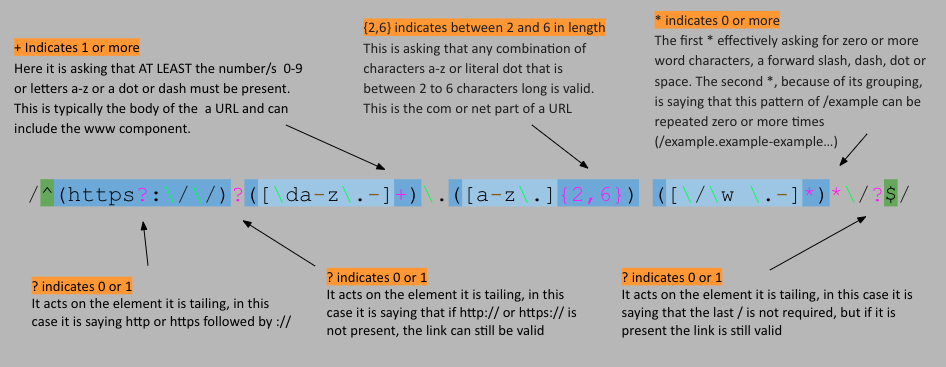

# Regex-URL-gist

This gist describes the procces of matching URL's with a regular expression set.

## Summary

Briefly summarize the regex you will be describing and what you will explain. Include a code snippet of the regex. Replace this text with your summary.

Matching a URL: `/^(https?:\/\/)?([\da-z\.-]+)\.([a-z\.]{2,6})([\/\w \.-]*)*\/?$/`

## Table of Contents

- [Anchors](#anchors)
- [Quantifiers](#quantifiers)
- [Grouping Constructs](#grouping-constructs)
- [Bracket Expressions](#bracket-expressions)
- [Character Classes](#character-classes)
- [The OR Operator](#the-or-operator)
- [Flags](#flags)
- [Character Escapes](#character-escapes)

## Regex Components

### Anchors
The regex expression used to match URL's...
 `/^(https?:\/\/)?([\da-z\.-]+)\.([a-z\.]{2,6})([\/\w \.-]*)*\/?$/`
...uses anchors on either end to define what charaters URL's typically begin or end with.

### Quantifiers

There are a number of quantifiers used in this regular expression. 
Qunatifiers can be used in a similar way of and/or gates. They can allow the programer to write a regex that can specify: 
* - zero-or-more
+ - one-or-more
? - zero-or-one
{4} - a specific quantity such as four 
{4,} - more than four 
{1,4} - or between one and three 

### Grouping Constructs

### Bracket Expressions

### Character Classes

### The OR Operator

### Flags

### Character Escapes

## Author

A short section about the author with a link to the author's GitHub profile (replace with your information and a link to your profile)

Please email any questions about this project to: Chrisw1096(you know it)gmail.com
or contact me though my github: 
[Wollemipines:](https://github.com/Wollemipines)
